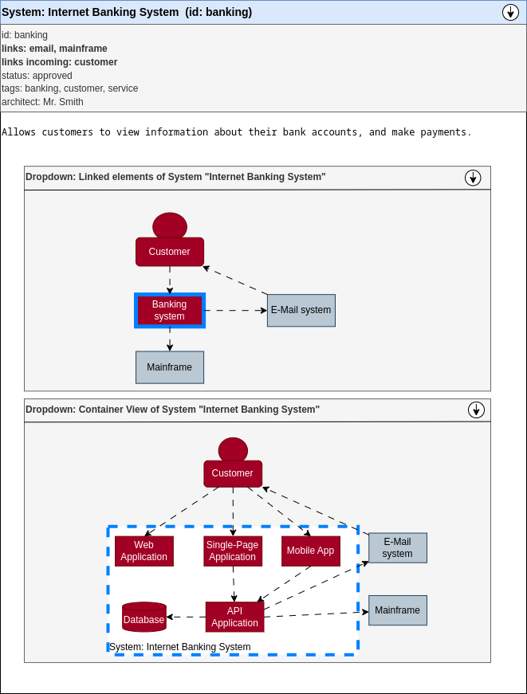
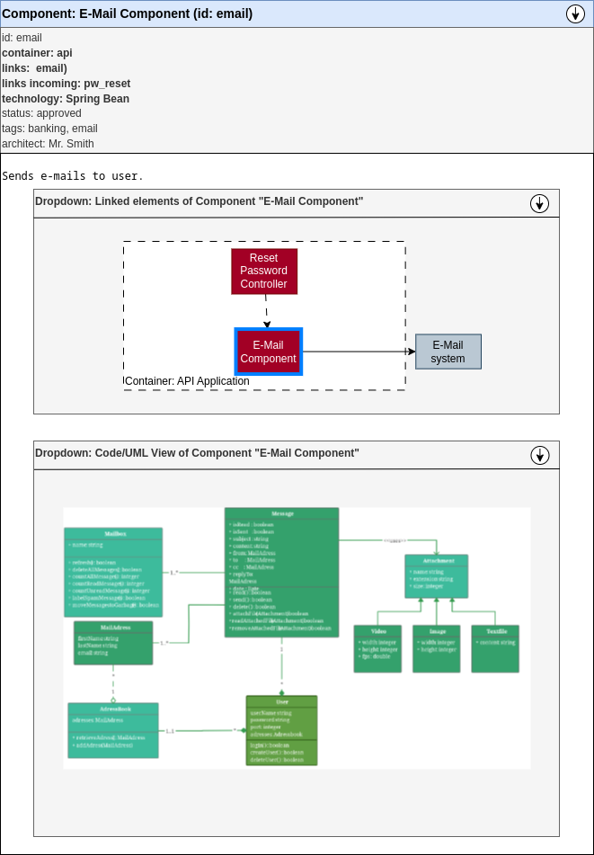

# sphinx-c4
Brings the C4 model into sphinx

## Technology collection

* [C4 model](https://c4model.com/)
* [C4 Example viewer](https://c4model.com/diagrams/example)
  *   A dynamic viewer, which shows sub-architectures via click on system-elements.
  *   Great, as it is a single "image", but provides so many interactive views
* [Diagram-as-code C4 support](https://diagrams.mingrammer.com/docs/nodes/c4)
  * Looks a little limited and the graphical representations are not 100% in sync or even available, like the mobile Component or person
* [Structurizr JS Viewer](https://github.com/structurizr/ui)
  * Used for the above example
  * MIT license
* [pystructurizr: Python interface for the structurizer JSON format](https://github.com/nielsvanspauwen/pystructurizr)
  * Could be used to generate the json and use the `ui` to show it

Structurizer DSL online editor: https://structurizr.com/dsl

## Assumptions

* We document the system, container, component level only.
* Documenting/Design the code architecture itself is not a topic
  * This is also often not done by teams, as the code is the truth
  *  The smallest code artifact, which can be checked against the architecture is the "SW Component"
  *  If more sw architecture is needed, another extension for SysML and other formats may be needed


## Tasks

### Keep it simple
This way just generates the C4 image for C4-Elements and views.
No export to an architecture-as-code DSL or other new tooling.

1. Define Sphinx-Needs types, options and links to represent C4 elements
   * System, Container, Component (Standard C4 elements)
   * Landscape/Diagram type or a `needc4` directive to describe the diagram to show on landscape view.
2. Use [Diagram-as-code C4 support](https://diagrams.mingrammer.com/docs/nodes/c4) to paint images for the related C4 elements
   * Not sure if this is a good idea because the lib lacks real C4 support

### Going the Structurizere way
This is creating a structurizer model out of the Sphinx-Needs model, so that other tools can use the outcome and e.g. generate images on the fly.
However, the support for this format is very limited in other tools and especially often not Open-Source.

1. Define Sphinx-Needs types, options and links to represent C4 elements
2. Create a `pystructurizr` model out of the Sphinx-Needs objects.
3. Use the needarch concept: A system defines the connections of imported containers
   * This is then also a c4 view
4. **TBD**: Provide ``needview`` to define a customc4-based view


## Needed Sphinx-Needs types

* Common
  * Person / Customer
* Software System
  * Software System
  * Existing System
* Container
  * Container
  * Container, Database
  * Container, Webbrowser
  * Container, MobileApp
* Component
  * Component

## Example


```rst

.. person:: Personal Banking Customer
   :id: customer
   :links: banking
   :links_text: View account balances, and make payments using

   A customer of the bank, with personal bank accounts.
   

.. system:: Internet banking
   :id: banking
   :links: mainframe, email
   :links_text: Gets account information from and makes payments using:: Sends e-mail using

   Allows customers to view information about their bank accounts, and make payments.

.. system:: Mainframe
   :id: mainframe
   :existing:

   Stores all the core banking information about customers, accounts, transitions, etc.

.. system:: E-Mail System
   :id: email
   :existing:
   :links: customer[Sends e-mails to]

   The internal Microsoft Exchange e-mail system.


.. container:: API Application
   :id: api
   :system: banking
   :links: db(Reads from and writes to[SQL/TCP]), email(Makes API calls to[XML/HTTPS]), mainframe(Makes API calls to[XML/HTTPS])
   :technology: Java and Spring MVC
   :style: default # Could be also mobile, webbrowser

   Provides Internet banking functionallity via a JSON/HTTPS API.
   
.. component:: E-Mail Component
   :id: email
   :container: api
   :links: email(Sends email using)
   :technology: Spring Bean

   Sends e-mails to user.

// More containers and components exist in the pictures below, but are not written 
// down for this example. I'm lazy, sorry :)

```

### Representations
**Hint**: All images are just roughly designed. The final images will contain the looks from the C4 model by 100%.

#### System: Banking system




#### Container: API Application


#### Component: E-Mail 




#### Element-unspecific views (System, Container, Component)
**Hint:** Taken from https://c4model.com/diagrams/component and co.

A need-type independant view could be created by a `needc4` directive, and look like:


## Rules

* A container must define the system, it belongs to
* A component must define the container, it belongs to.
* Links from elements are going **top-down**, sideward (same level) or to existings systems (which are not more detailed)
  * A **system** links to other systems or to container
  * A **container** links to other containers or to components
  * A **component** links to other components or existing systems (e.g. e-mail componets sends email via existing "E-Mail system")
* Graphical representations of **bottom-up** links are automatically calculated. 
  * For instance: If the "banking system" is using the existing "E-Mail system", this is know because the component "E-mail component" of a container in the "banking system" is using the
    existing "E-Mail System".


## Challenges

* Some links are going from the System level into the Container level, e.g. a Customer is linked to a multiple containers (web app, mobile app).
  But not to the system (here "Banking system"), even if this link is shown on system-level pictures.
  So some graphical connections needs be derived from existing, deeper going links.
* All the views in the C4 model examples are showing the diagrams from a upper view point, with context to an upper element.
  For instance, the container view is showing all the containers from System "Banking system" and is not related to a specific container, just the system.
  Same for the component view, which is showing all Components of e.g. the API container.

  In our Sphinx-Needs <-> C4 mapping, this kind of view is only available on the "upper" level. So to see and understand the whole container interactions, you have to 
  go to the system, to get the picture. The container view in the container itself is just related to the current shown container. Otherwise all containers of a system, would
  show the same container view picture, which brings to benefit. Therefore the added context to the current container in the container view.
* Automotive needs for SW architecture Specification (Detailed design): C4 does not support it, others like SysML do. 
  **Do we need to add another level?** By Sphinx-Needs objects (e.g. runnables, interfaces) and their automatic creation from specs (SysML, ArchiMed, ...) or code?

* **What can be automated?**
  * Components creation from soruce code? (commercial service?)
  * UML-Diagram creation and especially linking to components (commercial?)
  * Checking source code elements against containers/compoents? (commercial?)

## New functions for Sphinx-Needs

* **Labled links** are needed, in best case with two arguments, as C4 needs a descript like "Makes API calls" and the used technology. for instance "REST/HTTPS".

Open points:

* ``needc4`` directive needs to be specified and especially the way how to use it.
  * How to get the complete system/container view of a given system
  * How to combine two or ore systems?
  * How to show the components of multiple containers in one picture? How to select the needed container-components to show?
